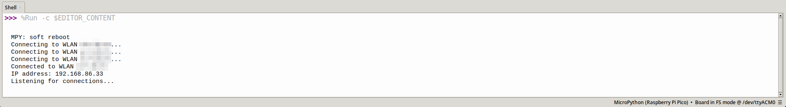
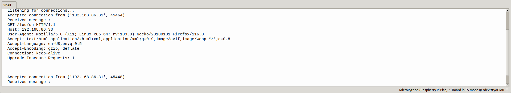

# WiFi LED

This example program is used to control the inbuilt LED of the v1.1 board,
over WiFi, using HTTP.

## Components Required
1. ASC IoT RPi Pico W Board v1.1
2. WiFi hotspot
3. A device connected to the hotspot, capable of running any web browser

## Instructions

1. Flash the MicroPython firmware to your development board
2. Open the source code file (`wifi_led.py`) in Thonny
3. Enter the values of the variables `SSID` and `password` 
4. Upload the code to your development board

5. Note the IP address from the Serial Monitor
6. Open your web browser, from a device connected to the same network
7. Enter the following into the address bar of the browser
`http://<IP Address>/led/<action>` where
    - `<IP Address>` is the actual IP address of the device from the Serial monitor
    - `<action>` is one of `on`, `off` and `status`
8. If the `<action>` is `on`, the LED is turned on, and if it is `off` then the LED is turned off
9. Irrespective of the `<action>`, text is displayed on the browser, indicating the status
of the LED\
10. Once the request has been sent, the Serial monitor will contain the details of the 
request: 

**NOTE:** 
1. Use a WPA2/PSK hotspot, running on the 2.4GHz band. Using the 5GHz band may or may not work
based on the exact specifications of the device used.
1. The `status` action does nothing. It exists simply to view the state of the LED.
2. A HTTP request with an invalid action will not elicit any response from the Pico W.
3. The `telnet` and `curl` linux commands can also be used to access the Pico W.
They must be directed to use port 80 of the Pico W.
4. This example does not make use of the HTTP Protocol completely, it simple finds the 
requested URL from the HTTP request. Refer [Code Explanation](#code-explanation)

## Code Explanation

The code has been explained using comments, in `wifi_led.py`. Please refer to the same.
